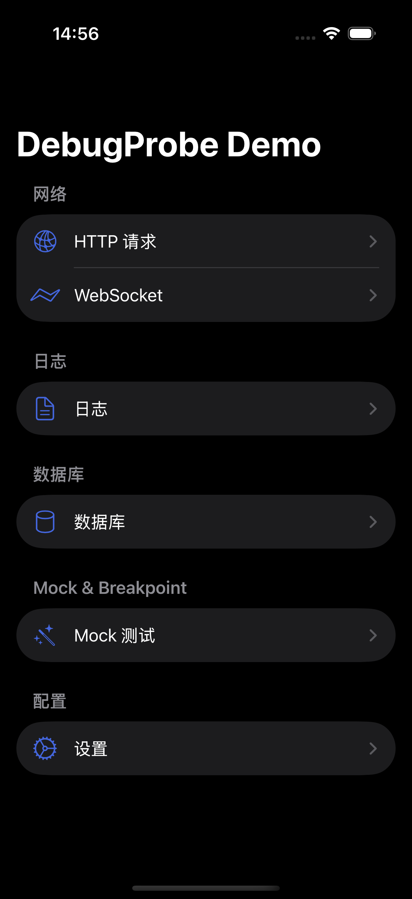
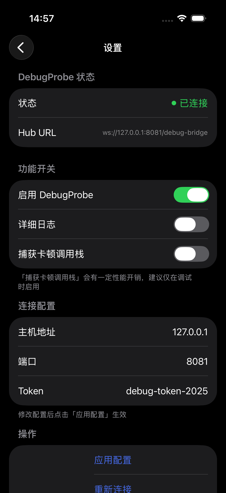
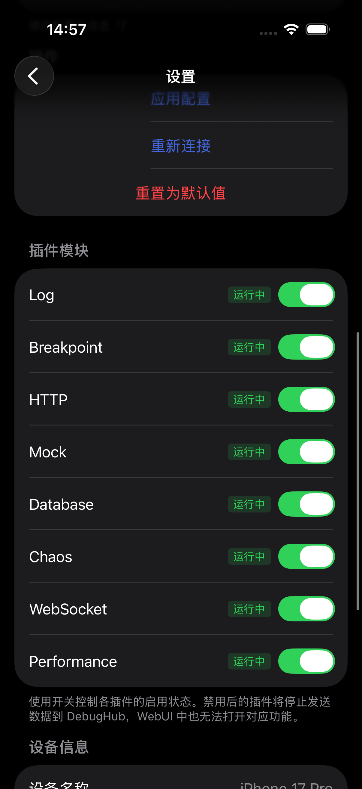
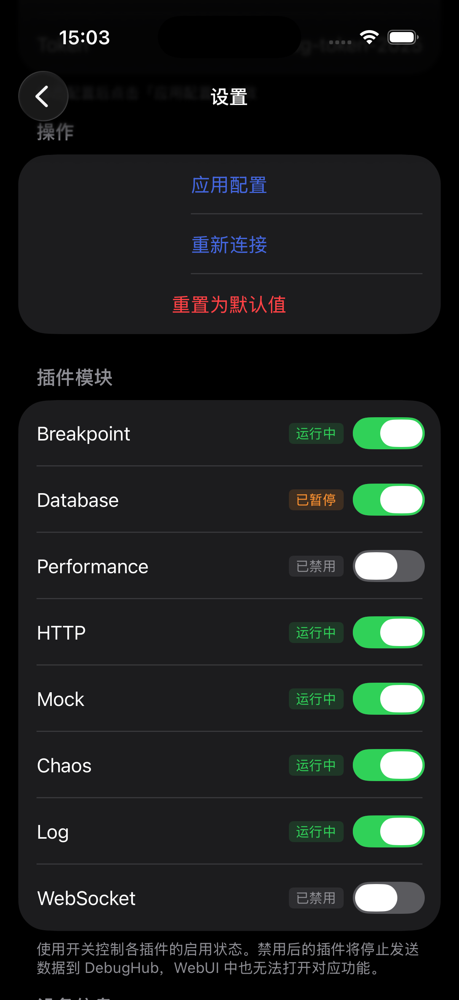

# DebugProbe

iOS App 调试探针 SDK，用于实时捕获和分析 App 的网络请求、日志、数据库等调试信息。

> [!IMPORTANT]
>
> **本项目全部代码和文档均由 AI Agent 生成**

> **当前版本**: 1.5.0 | [更新日志](CHANGELOG.md) | **最后更新**: 2025-12-17

## 功能特性

### 🌐 网络捕获

- **HTTP/HTTPS 请求捕获** - 自动拦截所有网络请求，包括 URLSession、Alamofire 等
- **WebSocket 监控** - 捕获 WebSocket 连接和消息
- **请求/响应详情** - 完整的 Headers、Body、Timing 信息
- **gRPC & Protobuf 支持** - 自动解析 Protobuf 格式数据

### 🎭 Mock Engine
- **请求 Mock** - 拦截请求并返回自定义响应
- **延迟注入** - 模拟网络延迟
- **条件匹配** - 支持 URL、Method、Header 等多种匹配规则

### 🔧 断点调试
- **请求断点** - 暂停请求并允许修改
- **响应断点** - 拦截响应并允许修改后返回
- **实时编辑** - 在 Web UI 中直接编辑请求/响应内容

### 💥 Chaos Engineering
- **延迟注入** - 模拟网络延迟
- **超时模拟** - 模拟请求超时
- **错误码注入** - 返回指定的 HTTP 错误码
- **连接重置** - 模拟网络中断
- **数据损坏** - 模拟响应数据损坏

### 📋 日志捕获
- **CocoaLumberjack 集成** - 自动捕获 DDLog 日志
- **OSLog 支持** - 捕获系统日志
- **自定义日志** - 支持自定义日志级别和分类

### 🗄️ 数据库检查
- **SQLite 浏览** - 查看 App 内的 SQLite 数据库
- **表数据查询** - 支持分页、排序、SQL 查询
- **Schema 查看** - 查看表结构

### 📊 性能监控
- **CPU 使用率** - 实时监控 App CPU 占用
- **内存使用** - 监控内存占用和内存压力
- **帧率 (FPS)** - 实时帧率监控和卡顿检测
- **App 启动时间** - 冷启动/热启动耗时分析
- **页面耗时** - 自动/手动采集页面加载耗时

## 📸 截图预览

| | |
|:---:|:---:|
|  |  |
|  |  |

## 安装

### Swift Package Manager

在 `Package.swift` 中添加依赖：

```swift
dependencies: [
    .package(url: "https://github.com/example/DebugProbe.git", branch: "main")
]
```

或在 Xcode 中：
1. File → Add Package Dependencies
2. 输入仓库 URL
3. 选择版本并添加到目标

## 快速开始

### 1. 最简启动（推荐）

```swift
import DebugProbe

// 在 AppDelegate 或 App 入口处初始化
func application(_ application: UIApplication, didFinishLaunchingWithOptions...) -> Bool {
    
    #if DEBUG
    // 自动从 DebugProbeSettings 读取配置（hubHost, hubPort, token）
    DebugProbe.shared.start()
    #endif
    
    return true
}
```

### 2. 配置 DebugProbeSettings（可选）

`DebugProbeSettings` 是 SDK 的配置管理中心，支持多层配置优先级：**运行时配置 > Info.plist > 默认值**

```swift
// 方式一：在代码中设置默认值（适合打包时配置）
DebugProbeSettings.defaultHost = "192.168.1.100"  // 默认 "127.0.0.1"
DebugProbeSettings.defaultPort = 8081             // 默认 8081

// 方式二：运行时配置（会持久化到 UserDefaults）
DebugProbeSettings.shared.configure(
    host: "192.168.1.100",
    port: 8081,
    token: "my-token"
)

// 方式三：通过 Info.plist 配置
// DEBUGHUB_HOST = "192.168.1.100"
// DEBUGHUB_PORT = 8081
// DEBUGHUB_TOKEN = "my-token"
```

### 3. 配置变更自动重连

```swift
// 监听配置变更通知
NotificationCenter.default.addObserver(
    forName: DebugProbeSettings.configurationDidChangeNotification,
    object: nil,
    queue: .main
) { _ in
    // 自动从 DebugProbeSettings 读取新配置并重连
    DebugProbe.shared.reconnect()
}
```

### 4. 自定义启动参数

```swift
#if DEBUG
// 可以预先配置参数
let settings = DebugProbeSettings.shared
settings.hubHost = "192.168.1.100"     // 自定义 Hub 地址
settings.networkCaptureMode = .automatic
settings.networkCaptureScope = .all
settings.enablePersistence = true

// 然后启动
DebugProbe.shared.start()
#endif
```

### 6. 注册数据库（可选）

```swift
import DebugProbe

// 注册要检查的数据库
DatabaseRegistry.shared.register(
    id: "main-db",
    name: "MyDatabase",
    url: databaseURL,
    kind: "main",
    isSensitive: false
)

// 或自动发现目录下的所有 SQLite 数据库
DatabaseRegistry.shared.autoDiscover(in: documentsURL)
```

### 7. 自定义日志（可选）

```swift
// 发送自定义调试日志
DebugProbe.shared.log(
    level: .info,
    message: "用户登录成功",
    subsystem: "Auth",
    category: "Login"
)

// 便捷方法
DebugProbe.shared.debug("调试信息")
DebugProbe.shared.info("普通信息")
DebugProbe.shared.warning("警告信息")
DebugProbe.shared.error("错误信息")
```

### 8. CocoaLumberjack 集成（可选）

DebugProbe SDK 不包含 CocoaLumberjack 依赖。如果您的项目使用 CocoaLumberjack，需要手动创建桥接器：

```swift
#if canImport(CocoaLumberjack)
import Foundation
import CocoaLumberjack
import DebugProbe

/// CocoaLumberjack 日志桥接器
public final class DDLogBridgeLocal: DDAbstractLogger {
    private var _logFormatter: DDLogFormatter?

    override public var logFormatter: DDLogFormatter? {
        get { _logFormatter }
        set { _logFormatter = newValue }
    }

    override public func log(message logMessage: DDLogMessage) {
        DebugProbe.shared.log(
            level: mapDDLogFlagToLevel(logMessage.flag),
            message: logMessage.message,
            subsystem: logMessage.fileName,
            category: logMessage.function ?? "DDLog"
        )
    }

    private func mapDDLogFlagToLevel(_ flag: DDLogFlag) -> LogEvent.Level {
        switch flag {
        case .verbose: return .verbose
        case .debug: return .debug
        case .info: return .info
        case .warning: return .warning
        case .error: return .error
        default: return .debug
        }
    }
}
#endif
```

然后在 AppDelegate 中注册：

```swift
#if canImport(CocoaLumberjack)
DDLog.add(DDLogBridgeLocal())
DDLog.add(DDOSLogger.sharedInstance)  // 可选：保留控制台输出
#endif
```

## API 概览

### DebugProbe

| 方法 | 说明 |
|------|------|
| `start()` | 使用 DebugProbeSettings 配置启动（推荐） |
| `stop()` | 停止 DebugProbe |
| `reconnect()` | 使用 DebugProbeSettings 配置重连（推荐） |
| `reconnect(hubURL:token:)` | 使用指定 URL 和 Token 重连 |
| `retryConnection()` | 手动重试连接（用于连接失败后） |
| `isStarted` | 是否已启动 |
| `connectionState` | 当前连接状态 |

### DebugProbeSettings

| 属性/方法 | 说明 |
|----------|------|
| `hubHost` | Hub 主机地址 |
| `hubPort` | Hub 端口 |
| `token` | 认证 Token |
| `hubURL` | 完整的 WebSocket URL |
| `isEnabled` | 是否启用 DebugProbe |
| `verboseLogging` | 是否启用详细日志 |
| `configure(host:port:token:)` | 快速配置 |
| `configure(from: URL)` | 从 URL 解析配置（如扫码） |
| `resetToDefaults()` | 重置为默认值 |
| `connectionStatusDetail` | 连接状态详情 |
| `configurationDidChangeNotification` | 配置变更通知 |

## 架构

### 插件化架构

DebugProbe 采用插件化架构，所有功能模块（网络、日志、Mock 等）均以插件形式实现：

```
┌─────────────────────────────────────────────────────────────────────────────┐
│                              DebugProbe SDK                                  │
├─────────────────────────────────────────────────────────────────────────────┤
│                                                                             │
│  ┌───────────────┐   ┌───────────────┐   ┌───────────────┐                 │
│  │   HttpPlugin  │   │   LogPlugin   │   │WebSocketPlugin│                 │
│  │  (HTTP 捕获)   │   │  (日志捕获)    │   │  (WS 监控)    │                 │
│  └───────┬───────┘   └───────┬───────┘   └───────┬───────┘                 │
│          │                   │                   │                          │
│  ┌───────────────┐   ┌───────────────┐   ┌───────────────┐                 │
│  │  MockPlugin   │   │BreakpointPlugin│  │  ChaosPlugin  │                 │
│  │  (Mock 规则)   │   │  (断点调试)    │   │  (故障注入)   │                 │
│  └───────┬───────┘   └───────┬───────┘   └───────┬───────┘                 │
│          │                   │                   │                          │
│          ▼                   ▼                   ▼                          │
│  ┌───────────────────────────────────────────────────────────────────────┐ │
│  │                      PluginManager + EventCallbacks                    │ │
│  │  • 插件生命周期管理（注册/启动/停止）                                   │ │
│  │  • 事件路由（捕获层 → 插件层 → BridgeClient）                          │ │
│  │  • 命令分发（服务端命令 → 目标插件）                                    │ │
│  └───────────────────────────────────────────────────────────────────────┘ │
│          │                                                                  │
│          ▼                                                                  │
│  ┌───────────────────────────────────────────────────────────────────────┐ │
│  │                       DebugBridgeClient                                │ │
│  │  • 内置事件缓冲区 (丢弃策略、持久化)                                    │ │
│  │  • WebSocket 通信                                                      │ │
│  │  • 批量发送、断线重连                                                   │ │
│  └───────────────────────────────────────────────────────────────────────┘ │
│                                    │                                        │
└────────────────────────────────────┼────────────────────────────────────────┘
                                     │ WebSocket
                                     ▼
                              ┌─────────────┐
                              │ Debug Hub   │
                              │  (服务端)    │
                              └─────────────┘
```

### 内置插件

| 插件 ID | 插件名称 | 功能 |
|---------|---------|------|
| `http` | HttpPlugin | HTTP/HTTPS 请求捕获 |
| `log` | LogPlugin | 日志捕获（DDLog, OSLog） |
| `websocket` | WebSocketPlugin | WebSocket 连接监控 |
| `mock` | MockPlugin | HTTP/WS Mock 规则管理 |
| `database` | DatabasePlugin | SQLite 数据库检查 |
| `breakpoint` | BreakpointPlugin | 请求/响应断点调试 |
| `chaos` | ChaosPlugin | 故障注入（Chaos Engineering） |
| `performance` | PerformancePlugin | 性能监控（CPU/内存/FPS/页面耗时） |

### 目录结构

```
DebugProbe/
├── Sources/
│   ├── Core/
│   │   ├── DebugProbe.swift          # 主入口
│   │   ├── DebugBridgeClient.swift   # WebSocket 通信 + 事件缓冲
│   │   ├── EventPersistenceQueue.swift # 事件持久化
│   │   └── Plugin/
│   │       ├── PluginManager.swift   # 插件管理器
│   │       ├── EventCallbacks.swift  # 事件回调中心
│   │       └── PluginBridgeAdapter.swift # 命令路由适配器
│   ├── Plugins/
│   │   ├── Engines/
│   │   │   ├── BreakpointEngine.swift    # 断点引擎
│   │   │   ├── ChaosEngine.swift         # 故障注入引擎
│   │   │   └── MockRuleEngine.swift      # Mock 规则引擎
│   │   ├── HttpPlugin.swift          # HTTP 网络插件
│   │   ├── LogPlugin.swift           # 日志插件
│   │   ├── WebSocketPlugin.swift     # WebSocket 插件
│   │   ├── MockPlugin.swift          # Mock 插件
│   │   ├── DatabasePlugin.swift      # 数据库插件
│   │   ├── BreakpointPlugin.swift    # 断点插件
│   │   ├── ChaosPlugin.swift         # Chaos 插件
│   │   └── PerformancePlugin.swift   # 性能监控插件
│   ├── Network/
│   │   ├── NetworkInstrumentation.swift  # HTTP 拦截基础设施
│   │   └── WebSocketInstrumentation.swift # WebSocket 拦截基础设施
│   ├── Log/
│   │   └── DDLogBridge.swift         # CocoaLumberjack 桥接
│   ├── Database/
│   │   └── DatabaseRegistry.swift    # 数据库注册
│   └── Models/
│       └── ...                       # 数据模型
└── Package.swift
```

## 与 DebugHub 配合使用

DebugProbe 需要配合 [DebugHub](https://github.com/sunimp/DebugPlatform) 服务端使用：

1. 启动 DebugHub 服务器
2. 在 iOS App 中配置 DebugProbe 连接到 DebugHub
3. 打开 Web UI (http://localhost:8081) 查看调试信息

## Demo 工程

项目包含完整的 Demo 工程，演示所有功能模块的使用方法：

```bash
# Demo 工程位置
DebugProbe/Demo/DebugProbeDemo/

# 使用 Xcode 打开
open Demo/DebugProbeDemo/DebugProbeDemo.xcodeproj
```

Demo 包含以下功能演示：
- **HTTP 请求** - GET/POST/PUT/DELETE/文件上传/并发请求
- **WebSocket** - 连接管理、消息收发
- **日志系统** - 多级别日志发送
- **数据库** - SQLite CRUD 操作
- **Mock 规则** - API Mock 配置
- **设置** - DebugHub 连接配置

详见 [Demo README](Demo/README.md)

## 要求

- iOS 14.0+
- macOS 12.0+
- Swift 5.9+
- Xcode 15.0+

## 可选依赖

- [CocoaLumberjack](https://github.com/CocoaLumberjack/CocoaLumberjack) - 用于日志捕获集成

## License

MIT License

## 相关项目

- [Debug Platform](https://github.com/sunimp/DebugPlatform) - 完整的调试平台（包含 Debug Hub 服务端和 Web UI）
